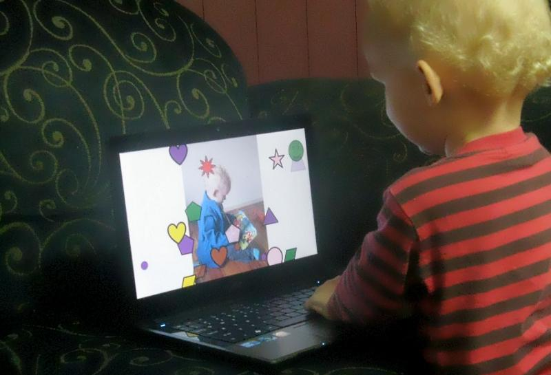

# Baby Bash XNA

A [Baby Smash](http://www.hanselman.com/babysmash/) clone for the XNA Framework.

** IMPORTANT **

Since migrating from Codeplex, I have not been able to update the ClickOnce installer.
I have no idea if the installer still works.
 
** IMPORTANT **

[Download Installer](http://babybashxna.codeplex.com/releases/)

* Babies and Toddlers bash the keyboard and see colourful shapes appear on the screen.
* Encourages interaction on the computer.
* Builds fine and gross motor skills in young children.
* Supports mouse drawing.
* Supports XBox 360 controller button bashing and analogue controls.
* Configurable Baby Packages and customisable sounds and graphics.
* Locks out Windows key and ALT + F4 to prevent harm to your computer (no responsibility taken for damage to keyboard!).
* Anti-Mashing technology to dissuade bashing lots of keys at once.

Developers may be interested in the following:
* Threaded loading using Task Parallel Library.
* Exception handling framework.
* Customisation using a Baby Package XML file with your very own (or a friend's) sounds and graphics.
* Automated updates using ClickOnce.
 
 
## Screenshots

Loading Screen

Before Children Start Playing

After Children Play

Baby Bash In Action!

